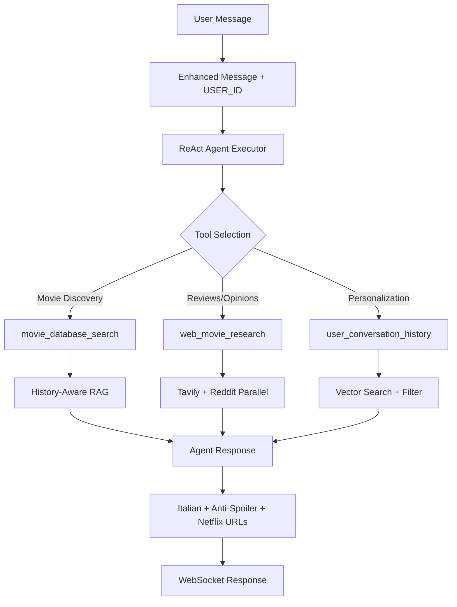

# 🎬 Netflix AI Chat - Architettura Backend

> **Sistema Conversazionale per Raccomandazioni Cinematografiche**  
> Versione: 1.0 | Data: Gennaio 2025 | Framework: LangChain  

---

## 📋 Panoramica del Sistema

### 🎯 Mission
Chatbot intelligente per la scoperta di film su Netflix attraverso conversazioni naturali in italiano, combinando database interno con ricerche web community-driven.

### 🏗️ Architettura High-Level
```
┌─────────────────────────────────────────────────────────────────┐
│                    NETFLIX AI CHAT BACKEND                     │
├─────────────────────────────────────────────────────────────────┤
│  🌐 FastAPI WebSocket Server (main.py)                         │
├─────────────────────────────────────────────────────────────────┤
│  🤖 MovieChatAgent (agent/agent.py)                            │
│    ├── ReAct Agent Executor + Memory Management                │
│    └── 3 Specialized Tools Pipeline                            │
├─────────────────────────────────────────────────────────────────┤
│  🛠️ TOOLS LAYER                                                │
│    ├── 📚 MovieDatabaseSearchTool (History-Aware RAG)          │
│    ├── 🌍 WebMovieResearchTool (Tavily + Reddit Parallel)      │
│    └── 👤 UserHistoryTool (Personalization Engine)             │
├─────────────────────────────────────────────────────────────────┤
│  💾 DATA LAYER                                                 │
│    ├── 🎞️ Films Vector Store (53 movies, rich descriptions)    │
│    ├── 👥 Users Vector Store (conversation history)            │
│    └── 📊 Chroma Database (FAISS-like, persistent)             │
└─────────────────────────────────────────────────────────────────┘
```

---

## 🔧 Componenti Core

### 1. 🌐 **FastAPI WebSocket Server** (`main.py`)

**Responsabilità:**
- Gestione connessioni WebSocket real-time per chat
- CORS configuration per frontend
- Health check endpoints
- Testing mode con user ID fisso (`vincenzo01`)

**Endpoints:**
```python
# WebSocket principale
ws://localhost:8000/chat/{user_id}

# Health check
GET /health → {"status": "healthy", "agent": "ready"}

# Test info
GET /test-info → {"test_mode": True, "forced_user_id": "vincenzo01"}
```

**Flusso di Esecuzione:**
1. Client si connette via WebSocket
2. Ogni messaggio utente viene processato da `MovieChatAgent`
3. Response viene inviata in tempo reale

---

### 2. 🤖 **MovieChatAgent** (`agent/agent.py`)

**Architettura:**
- **Pattern:** ReAct Agent Executor con Memory
- **LLM:** GPT-4 (configurabile)
- **Memory:** `RunnableWithMessageHistory` + `ChatMessageHistory`
- **Tools:** 3 specialist tools con structured input/output

**Pipeline Decisionale:**


**Error Handling Robusto:**
- Custom parsing error handler
- Fallback responses per tool failures
- Graceful degradation quando ReAct format fallisce

---

### 3. 📚 **MovieDatabaseSearchTool** (`tools/movie_database_search.py`)

**Architettura LCEL (LangChain Expression Language):**
```python
# Pipeline History-Aware RAG
contextualization_prompt + llm + retriever 
→ history_aware_retriever 
→ qa_prompt + llm 
→ create_stuff_documents_chain
→ create_retrieval_chain
```

**Fasi Pipeline:**
1. **Contextualization:** Riscrittura query history-aware
2. **Retrieval:** Semantic search su vector store films
3. **QA Generation:** Risposta contestualizzata in italiano

**Caratteristiche:**
- **Input:** `{query: str, chat_history: List[Messages]}`
- **Output:** Raccomandazioni con availability + Netflix URLs
- **Anti-Spoiler:** Policy rigorosa contro plot twist
- **Metadata:** Include pricing, rating, cast, director

---

### 4. 🌍 **WebMovieResearchTool** (`tools/web_movie_research.py`)

**Architettura Parallel Search:**
```python
# Pipeline con RunnableParallel
contextualization_prompt 
→ standalone_query 
→ RunnableParallel{
    tavily: tavily_search,
    reddit: reddit_search
  }
→ results_synthesis_prompt + llm
```

**Fonti Parallele:**
- **Tavily:** Reviews professionali + critiche cinematografiche
- **Reddit:** Community opinions da r/movies

**Output:**
- Sintesi intelligente in italiano
- Confronto opinioni critiche vs community
- Zero spoiler policy
- Suggerimenti per ricerche aggiuntive

---

### 5. 👤 **UserHistoryTool** (`tools/user_history_tool.py`)

**Personalizzazione Engine:**
- **Input Format:** `"user_id:USER_ID [optional_context]"`
- **Retrieval:** Vector search con filtro esatto su metadata
- **Output:** Storico preferenze + film discussi

**Mock Data per Demo:**
- Profili utente realistici con preferenze cinematografiche
- Conversation history pre-popolata
- Metadata ricchi: generi preferiti, mood, film discussi

---

## 💾 Data Layer Architecture

### **Dual Vector Database** (`database/vector_database.py`)

**Strategia:** 2 Chroma Collections separate per performance e isolamento

#### 🎞️ Films Collection
- **Dataset:** 53 film con descrizioni ultra-ricche
- **Content Strategy:** Focus su mood, atmosfere, emozioni
- **Metadata:** Availability, pricing, Netflix URLs, cast, rating
- **Semantic Search:** Ottimizzato per discovery emotivo

**Content Structure:**
```python
film_content = f"""
{title} ({year})

GENERI E ATMOSFERA: {mood_description}
TRAMA COMPLETA: {detailed_plot}  
STILE E REGIA: {directorial_style}
EMOZIONI E TEMI: {emotional_impact}
ESPERIENZA VISIVA: {visual_style}
"""
```

#### 👥 Users Collection
- **Dataset:** Mock conversation history per personalizzazione
- **Filter Strategy:** Exact match su `user_id` nei metadata
- **Content:** Preferenze + riassunti conversazioni precedenti

---

## ⚙️ Configuration System

### **Config Class** (`config.py`)
```python
@dataclass
class Config:
    # API Keys (via .env)
    openai_api_key: str
    tavily_api_key: str  
    reddit_client_id: str
    reddit_client_secret: str
    
    # Vector Store Paths
    films_vectorstore_path: str = "./data/chroma_films"
    users_vectorstore_path: str = "./data/chroma_users"
    
    # Model Settings
    llm_model: str = "gpt-4o"
    llm_temperature: float = 0.1
    max_tokens: int = 1000
    
    # Search Parameters
    films_search_k: int = 5
    tavily_max_results: int = 5
    reddit_max_results: int = 10
```

---

## 🔄 Flussi di Esecuzione

### **Scenario 1: Discovery Generico**
```
User: "Voglio un thriller psicologico"
│
├── Agent decide: movie_database_search
├── Semantic search su films vector store
├── Retrieve: film con mood "tensione psicologica"
└── Response: Lista film con Netflix URLs + why-recommendations
```

### **Scenario 2: Film Specifico + Community Research**
```
User: "Com'è Inception?"
│
├── Agent decide: movie_database_search + web_movie_research
├── Parallel execution:
│   ├── RAG su database interno → info base film
│   └── Tavily + Reddit → reviews e opinioni community
└── Response: Sintesi completa senza spoiler
```

### **Scenario 3: Ricerca Personalizzata**
```
User: "Qualcosa come i film che mi sono piaciuti"
│
├── Agent decide: user_conversation_history + movie_database_search
├── Sequential execution:
│   ├── Retrieve user preferences da users vector store
│   └── Semantic search con context personalizzato
└── Response: Raccomandazioni basate su storico
```

---

## 🛡️ Sicurezza e Robustezza

### **Error Handling Strategy**
- **Parsing Errors:** Custom handler con fallback responses
- **Tool Failures:** Graceful degradation per singoli tool
- **API Timeouts:** Retry logic su ricerche web
- **Empty Results:** Suggerimenti alternativi automatici

### **Anti-Spoiler Policy**
- **System Prompts:** Istruzioni rigorose contro plot twists
- **Content Filtering:** Review automatica delle responses
- **Safe Descriptions:** Focus su mood invece che eventi specifici

### **Performance Optimizations**
- **Vector Store Persistence:** Chroma disk storage
- **Parallel Tool Execution:** RunnableParallel per web research
- **Memory Management:** Window-based conversation history
- **Connection Pooling:** WebSocket persistenti

---

## 📊 Monitoraggio e Debugging

### **Logging Strategy**
- **Verbose Agent:** Detailed ReAct step tracing
- **Tool Execution:** Success/failure metrics per tool
- **User Sessions:** Conversation flow tracking
- **Performance:** Latency monitoring per pipeline stage

### **Testing Mode**
- **Fixed User ID:** `vincenzo01` per testing consistente  
- **Mock Data:** Profili utente pre-configurati
- **Health Checks:** Sistema status monitoring

---

## 🚀 Deployment Ready Features

### **Production Checklist**
- ✅ Environment-based configuration
- ✅ CORS security configuration
- ✅ Persistent vector storage
- ✅ Error handling robusto
- ✅ WebSocket connection management
- ✅ API key validation

### **Scalability Considerations**
- **Vector Store:** Chroma supporta scaling horizontale
- **Memory Management:** Session-based isolation
- **Tool Architecture:** Plugin-ready per nuovi data sources
- **LLM Abstraction:** Provider-agnostic implementation

---

